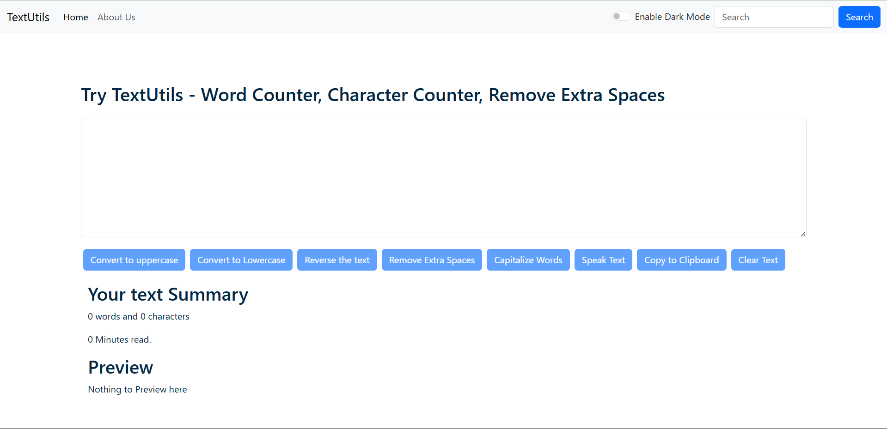
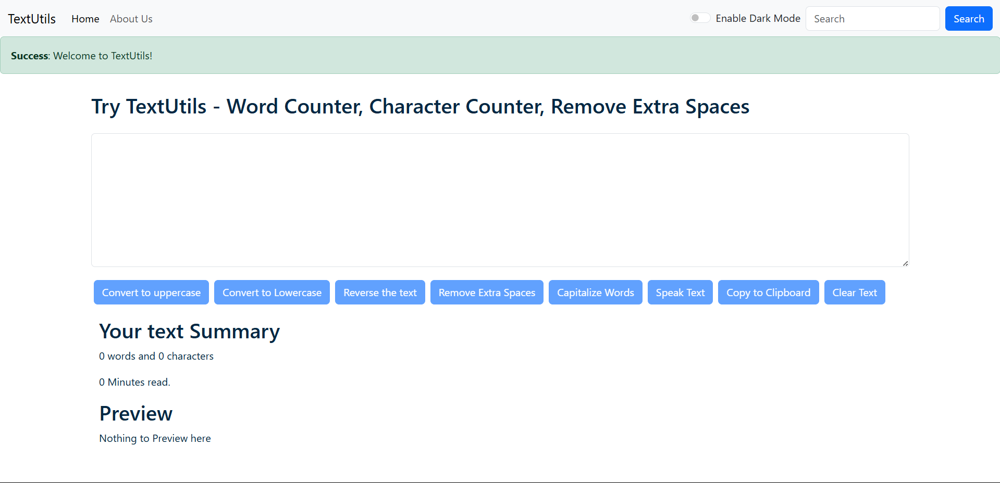
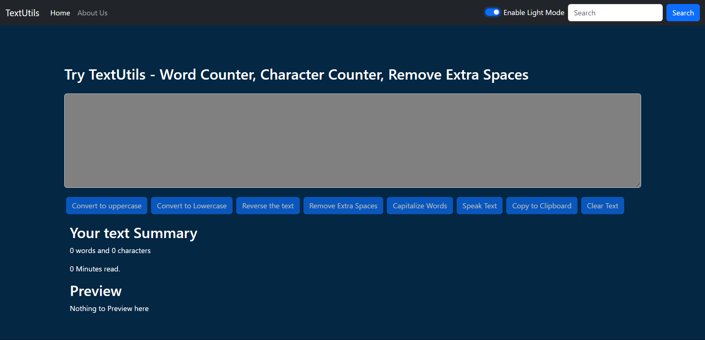
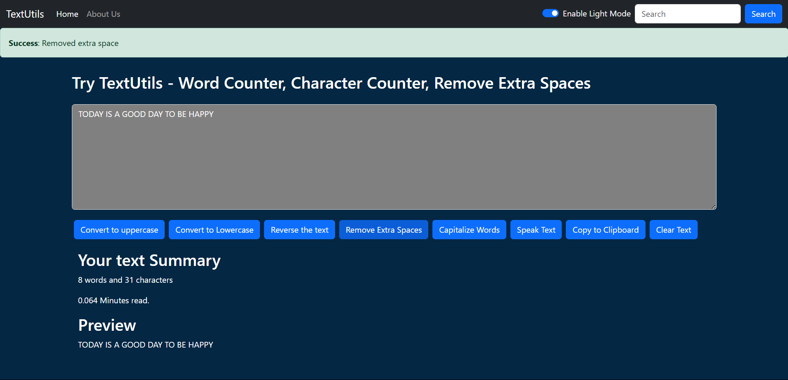
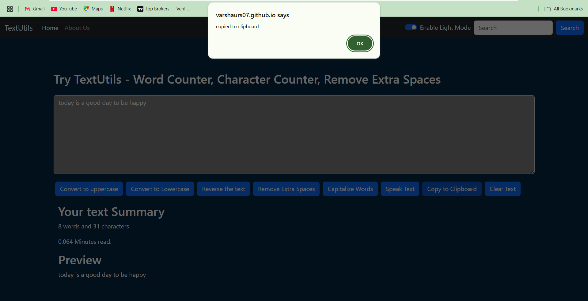
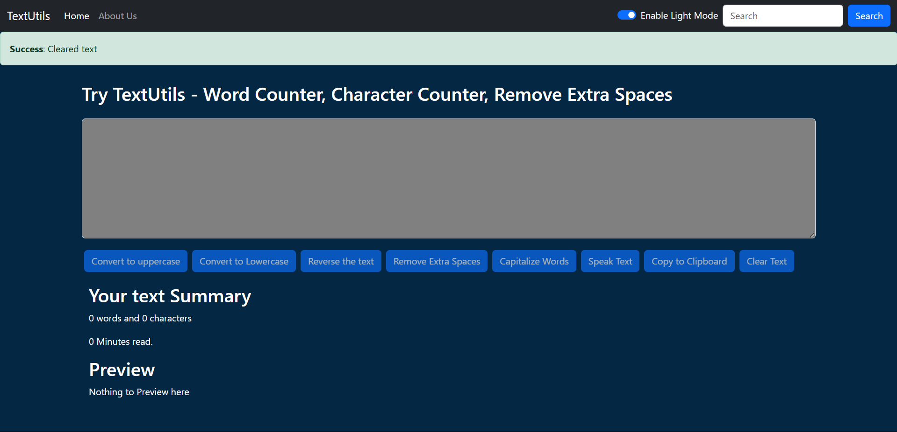
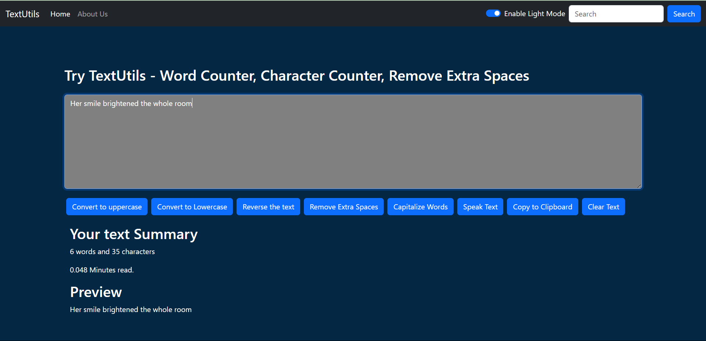
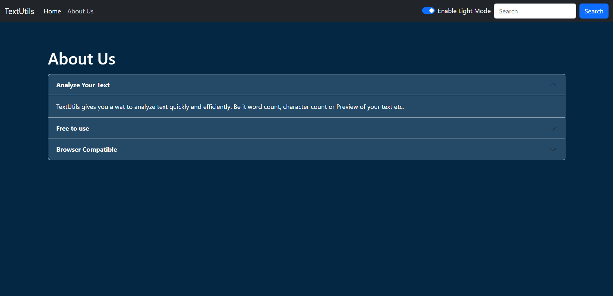

# 📘 TextUtils - React App

TextUtils is a simple React-based text utility app that allows users to manipulate and analyze text. It provides features like changing text case, removing extra spaces, copying to clipboard, and viewing text summary. It also supports light, # 📘 TextUtils - React App

## 🚀 Features

- ✅ Convert text to **uppercase**
- ✅ Convert text to **lowercase**
- ✅ **Clear** the entire text
- ✅ **Copy** text to clipboard
- ✅ **Remove** extra spaces
- ✅ Display **word & character count**
- ✅ Preview modified text
- ✅ Theme modes: Light, Dark, and Green
- ✅ Responsive and clean UI

## 🛠️ Technologies Used

- ⚛️ React JS
- 💄 Bootstrap
- 💡 JavaScript
- 🌐 HTML/CSS

## 🚀 Live Demo
[Click here to view the live app](https://Varshaurs07.github.io/TextUtils-React-app)


## 📁 How to Run Locally

```bash
git clone https://github.com/Varshaurs07/TextUtils-React-app.git
cd TextUtils-React-app
npm install
npm start

## 🖼️ Screenshots

### 🔹 Home Page  


### 🔹 Convert to Uppercase  


### 🔹 Alert Message  


### 🔹 Dark Mode Enabled  


### 🔹 Remove Extra Spaces  


### 🔹 Convert to Lowercase  


### 🔹 Copied to Clipboard  


### 🔹 Cleared Text  


### 🔹 Word & Character Count  


### 🔹 About Page  



